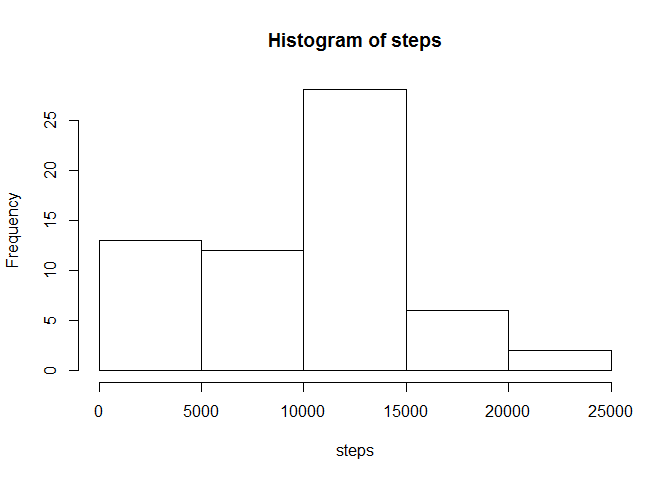
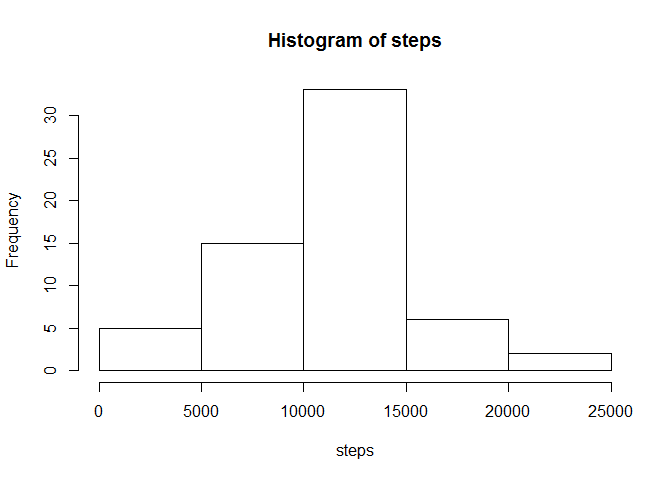
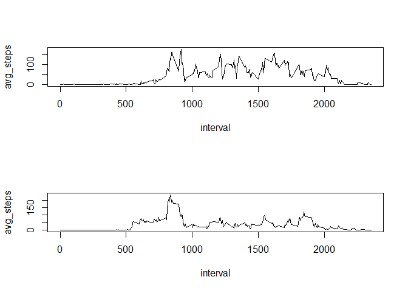

# Reproducible Research: Peer Assessment 1

## Loading and preprocessing the data

```r
library(lubridate)
suppressPackageStartupMessages(library(dplyr))
activity_data <-  read.csv("activity.csv", stringsAsFactors=F)
activity_data$day_of_week = wday(ymd(activity_data$date))
```


## What is mean total number of steps taken per day?

```r
activity_per_day <- activity_data %>% 
                        group_by(date) %>% 
                        summarise(steps = sum(steps, na.rm=T))
with(activity_per_day, hist(steps))
```

 

```r
summary(activity_per_day$steps)
```

```
##    Min. 1st Qu.  Median    Mean 3rd Qu.    Max. 
##       0    6778   10400    9354   12810   21190
```


## What is the average daily activity pattern?

```r
activity_per_interval <- activity_data %>% 
                                group_by(interval) %>% 
                                summarise(avg_steps= mean(steps, na.rm=T))
with(activity_per_interval, 
     plot(interval, avg_steps, type="l"))
```

 

```r
with(activity_per_interval, 
     print(interval[avg_steps == max(avg_steps)]))
```

```
## [1] 835
```


## Imputing missing values

```r
activity_per_interval_day <- activity_data %>% 
                                group_by(day_of_week, interval) %>% 
                                summarise(avg_steps= mean(steps, na.rm=T))
filled_data <- merge(activity_data, 
                     activity_per_interval_day, 
                     by=c('interval', 'day_of_week'))
filled_data <- filled_data[with(filled_data, order(date, interval)),]
filled_data$steps[is.na(filled_data$steps)] <- filled_data$avg_steps[is.na(filled_data$steps)]
fa_per_day <- filled_data %>% 
                        group_by(date) %>% 
                        summarise(steps = sum(steps, na.rm=F))
with(fa_per_day, hist(steps))
```

 

```r
summary(fa_per_day$steps)
```

```
##    Min. 1st Qu.  Median    Mean 3rd Qu.    Max. 
##      41    8918   11020   10820   12810   21190
```

## Are there differences in activity patterns between weekdays and weekends?

```r
filled_data$daytype = ifelse(filled_data$day_of_week %in% c(1,7), "weekend", "weekday")
activity_per_interval_daytype <- filled_data %>% 
                                group_by(daytype, interval) %>% 
                                summarise(avg_steps= mean(steps, na.rm=T))
par(mfrow=c(2,1))
weekend_data <- activity_per_interval_daytype %>%
                filter(daytype == "weekend")
with(weekend_data, plot(interval, avg_steps, type="l"))
weekday_data <- activity_per_interval_daytype %>%
                filter(daytype == "weekday")
with(weekday_data, plot(interval, avg_steps, type="l"))
```

 
