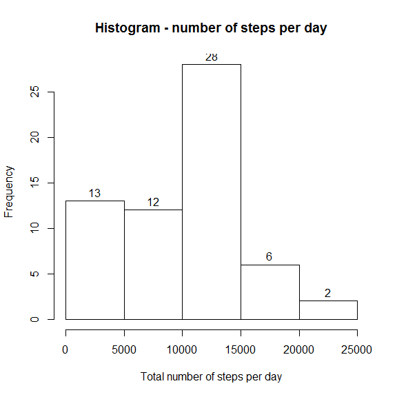
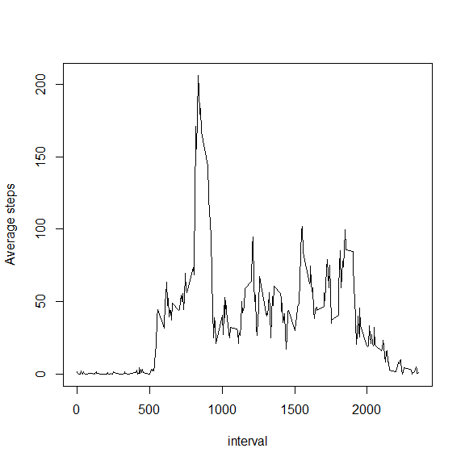
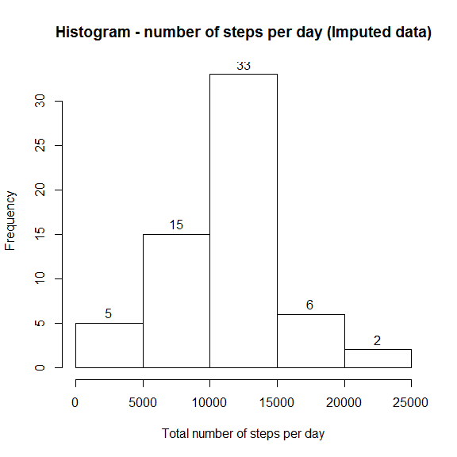
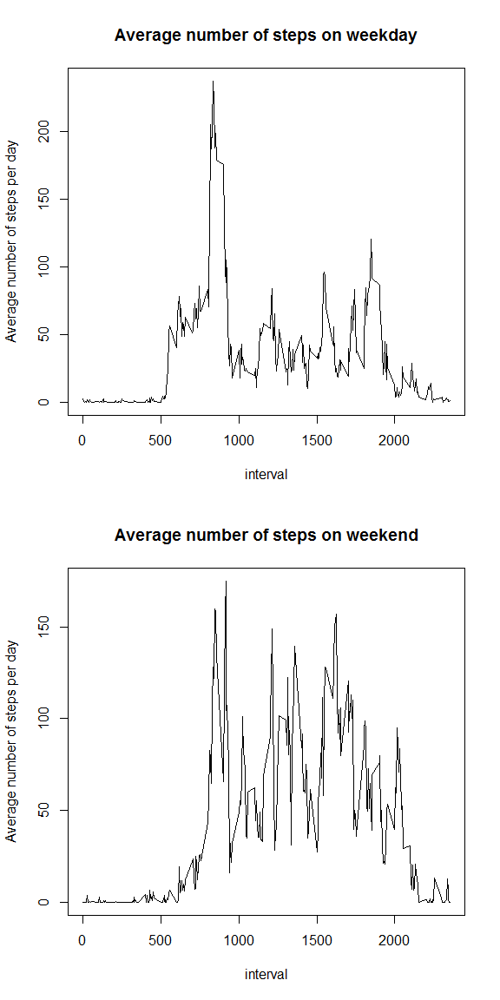

# Reproducible Research: Peer Assessment 1


## Loading and preprocessing the data
The data is read using read.csv() function with stringsAsFactors set to False.
We don't want to interpret the date colum as factors. Once read, get day of week
for the date and store it in a separate column.


```r
activity_data <-  read.csv("activity.csv", stringsAsFactors=F)
activity_data$day_of_week = wday(ymd(activity_data$date))
```

## What is mean total number of steps taken per day?
Use dplyr functions to group the data by dates and calculate the group sum. 
Create a histogram plot for the total steps per day.


```r
activity_per_day <- activity_data %>% 
                        group_by(date) %>% 
                        summarise(steps = sum(steps, na.rm=T))
with(activity_per_day, hist(steps, 
                            xlab="Total number of steps per day",
                            main="Histogram - number of steps per day",
                            labels=T))
```

 

Calculate the summary statistics of total number of steps per day and store it 
in a variable called 'stats_steps_per_day'.


```r
stats_steps_per_day <- summary(activity_per_day$steps)
```
Mean total number of steps per day is **9350** and 
Median total number of steps per day is **10400**.

## What is the average daily activity pattern?
To analyze average daily activity pattern, group the data by interval.

```r
activity_per_interval <- activity_data %>% 
                                group_by(interval) %>% 
                                summarise(avg_steps= mean(steps, na.rm=T))
with(activity_per_interval, 
     plot(interval, avg_steps, type="l", ylab="Average steps"))
```

 

Maximum number of steps is contained at the interval 
**835**.

## Imputing missing values
The missing number of steps for an interval, on a given day is 
substituted with the average number of steps calculated for that interval for
the corresponding day of week. This is done in two steps. First calculate the
average number of steps for all intervals on all days of week. Then this is 
merged with the activity data and later substituted for NAs.

```r
activity_per_interval_day <- activity_data %>% 
                                group_by(day_of_week, interval) %>% 
                                summarise(avg_steps= mean(steps, na.rm=T))
filled_data <- merge(activity_data, 
                     activity_per_interval_day, 
                     by=c('interval', 'day_of_week'))
filled_data <- filled_data[with(filled_data, order(date, interval)),]
filled_data$steps[is.na(filled_data$steps)] <- filled_data$avg_steps[is.na(filled_data$steps)]
fa_per_day <- filled_data %>% 
                        group_by(date) %>% 
                        summarise(steps = sum(steps, na.rm=F))
with(fa_per_day, hist(steps,
                            xlab="Total number of steps per day",
                            main="Histogram - number of steps per day (Imputed data)",
                            labels=T))
```

 

Calculate the summary statistics of total number of steps per day and store it 
in a variable called 'istats_steps_per_day'.


```r
istats_steps_per_day <- summary(fa_per_day$steps)
```

Mean total number of steps per day is **10800** and 
Median total number of steps per day is **11000**.

Comparing the two histograms it is clear that filling the NAs has caused a drop
in frequency of 0-5000 range and subsequently increased the next ranges. The 
number of steps was 0 for many instances due to the NAs and now has the average 
value as explained before. The overall mean and median number of steps per day 
have also increased due to this change.

## Are there differences in activity patterns between weekdays and weekends?
First create a column, 'daytype', as a factor marking each day as weekend or
weekday. Group the imputed data by daytype first and then by interval. Plot
the weekday and weekday data.


```r
filled_data$daytype = ifelse(filled_data$day_of_week %in% c(1,7), "weekend", "weekday")
activity_per_interval_daytype <- filled_data %>% 
                                group_by(daytype, interval) %>% 
                                summarise(avg_steps= mean(steps, na.rm=F))
weekend_data <- activity_per_interval_daytype %>%
                filter(daytype == "weekend")
weekday_data <- activity_per_interval_daytype %>%
                filter(daytype == "weekday")
par(mfrow=c(2,1))
with(weekday_data, 
     plot(interval, avg_steps, type="l",
          ylab="Average number of steps per day",
          main="Average number of steps on weekday"
          )
     )
with(weekend_data, 
     plot(interval, avg_steps, type="l",
          ylab="Average number of steps per day",
          main="Average number of steps on weekend")
     )
```

 
